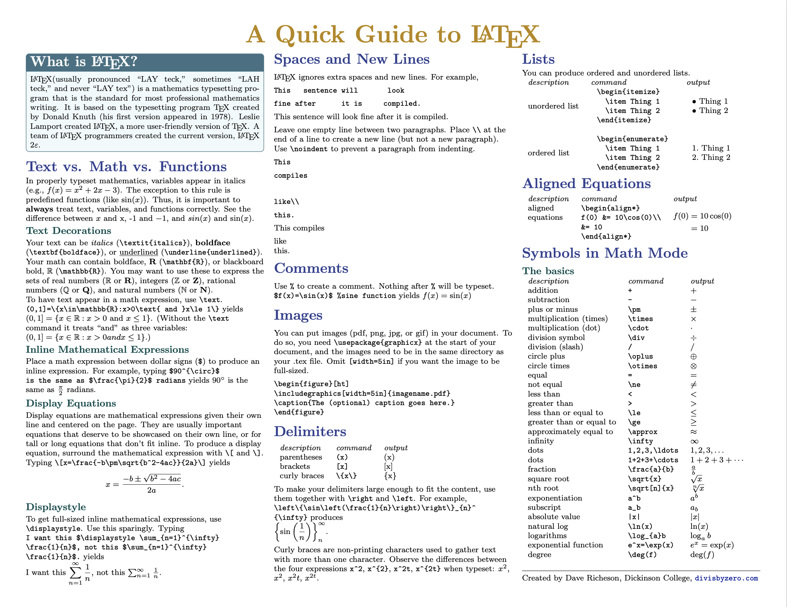
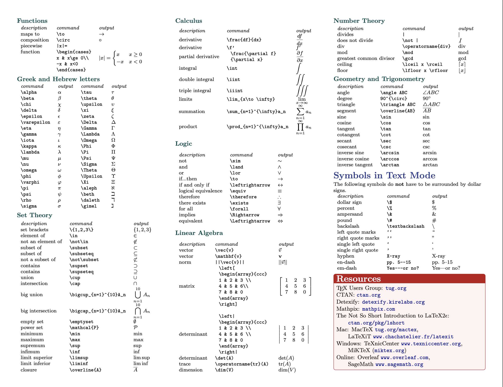

# A Quick Guide to LaTeX — A LaTeX Cheat Sheet

A quick-reference guide for LaTeX, originally authored by Dave Richeson.

## Files

- `latexcheatsheet.tex`: The LaTeX source
- `latexcheatsheet.pdf`: Precompiled PDF for easy viewing

## Preview

  
  

## License

This work is licensed under the [Creative Commons Attribution-NonCommercial 4.0 International](https://creativecommons.org/licenses/by-nc/4.0/) license (CC BY-NC 4.0).

You may share and adapt for **non-commercial purposes**, provided attribution is given.

## About

Originally shared via [divisbyzero.com](http://divisbyzero.com). This repository makes it easier to access, reuse, and contribute improvements.
