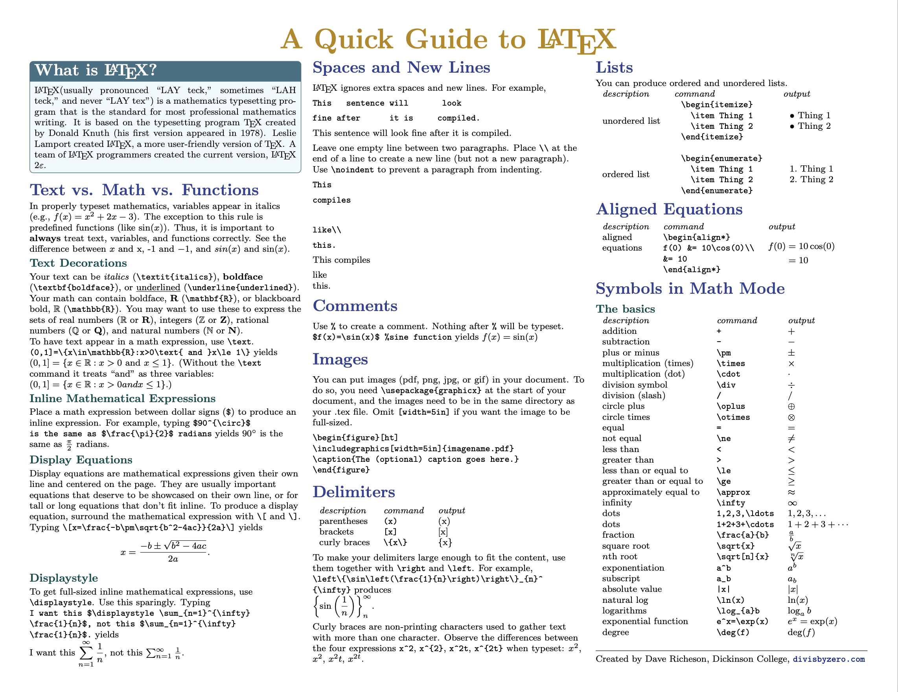
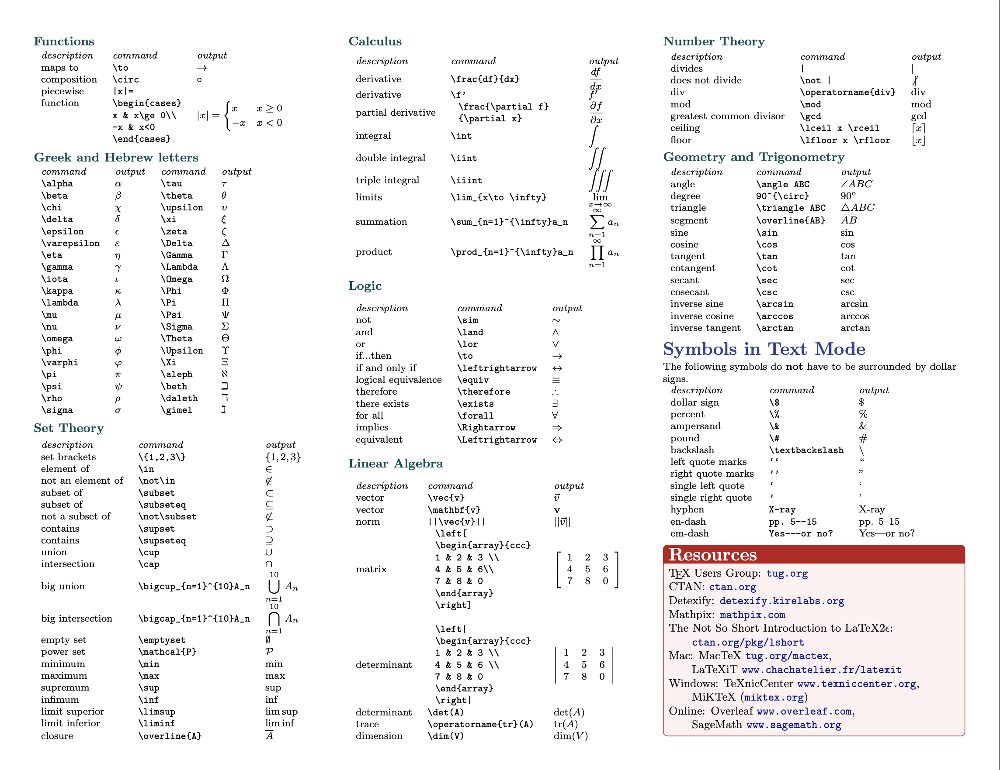

# A Quick Guide to LaTeX — A LaTeX Cheat Sheet

Welcome! This is a quick-reference guide for LaTeX compiled by Dave Richeson.

## View the PDF

[View or download the cheat sheet (PDF)](latexcheatsheet.pdf)

## Preview

  
  

## Download the LaTeX Source

If you'd like to edit or customize this document, you can download the LaTeX source file here:

[Download latexcheatsheet.tex](latexcheatsheet.tex)

You can also [view the full project on GitHub](https://github.com/divisbyzero/latex-cheatsheet) to see all files and contribute.

## About this project

This two-page document covers essential LaTeX commands, environments, and symbols, especially useful for mathematics students.

Feel free to share. See the LICENSE file for usage terms.
